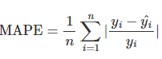

# Hồi quy tuyến tính #
- Học có giám sát -> mô hình được huấn luyện trên tập dữ liệu gán nhãn
- Thành phần học có giám sát:
    + Data set 
    + Nhãn 
    + Mô hình 
    + Hàm mất mát : đo lường sự khác biết giưa dự đoán và nhãn thực tế - Cross entropy ( phân loại )
        * tiêu chí đánh giá: MAPE, RMSE
    + __Quá trình tối ưu__: giảm thiểu mất mát
- Biến mục tiêu liên tục 
## Bài toán dự đoán 
- hồi quy tuyến tính đơn: $y = ax+b$  - quan hệ là 1 đường thẳng 
- Tổng quát: $y= a_{0} + a_{1}x_{1} + a_{2}x_{2}+...+a_{n}x_{n}$ 
    + hệ số a thể hiện tác động của x lên biến y 
- mặt phẳng (plane) 2 chiều ><  Siêu phẳng hyperplane nhiều chiều
## Phương trình hồi quy là tuyến tính 
- Dễ biểu dễ quan hệ giữa các biến đầu vào và biến mục tiêu 
## Hàm mất mát 
- Tìm cực trị của hàm mất mát
- Thường sử dụng MSE: tổng bình phương sai số giữa các giá trị dự báo và giá trị thực  
    - Đkien cần: đoạ hàm bậc 1 bằng 0 
    - Đkien đủ: đạo hàm bậc 2 > 0 or hàm là hàm lồi
## Hồi quy tuyến tính đa biến
- Hquy với nhiều biến đầu vào
- Dạng tổng quả: 
- Phương trình hồi qui đa biến khi A khả nghịch
## Diễn giải xác suất của hồi quy 
- 
## Huấn luyện mô hình hồi quy tuyến tính 
- Thư biện sklearn 
- Các bước thực hiện 
    1. thu thập dữ liệu 
    2. Làm sạch dữ liệu 
    3. Lựa chọn dữ liệu đầu vào 
    4. Chuẩn hoá dữ liệu 
    5. Chia train - test
    6. Huấn luyện và đánh giá
## Đánh giá mô hình đa biến 
- R-squared
    + Các biến đầu vào sẽ giải thích được bao nhiêu % của biến mục tiêu
    + Càng lớn càng tốt 
    + VD khi R^2 = 95% thì biến đầu vào sẽ giải thich đc 95% sự biến động của biến mục tiêu
    + Được xây dựng trên 3 chỉ số
        * 
    Giải thích 
        + TSS: Tổng bình phương sai số toàn bộ mô hình 
        + RSS: Tổng bình phương sai số ngẫu nhiêu 
        + ESS: Tổng bình phương sai số được giải thích bởi mô hình 

- MAE
    + Trung bình trị tuyệt đối sai số 
    + 
    + Không bao hàm được hết sự khác biệt về mặt đơn vị
- MAPE
    + Tỷ lệ % sai số 

# Ridge regression 
- Áp dụng kỹ thuật hiệu chuẩn để tránh quá khớp